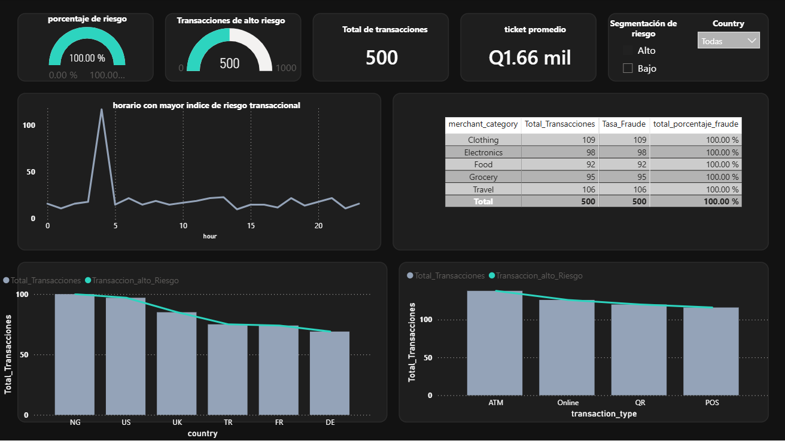

# Proyecto: Inteligencia de Riesgo y Fraude Transaccional (BancoGT)

## Descripción del Proyecto
Este proyecto documenta el ciclo completo de análisis de datos para la mitigación de fraudes en **BancoGT**. El objetivo principal fue transformar datos transaccionales brutos en inteligencia de negocio procesable para la toma de decisiones estratégicas, identificando anomalías temporales, canales vulnerables y perfiles de riesgo geográfico.

## Tecnologías Utilizadas
* **SQL Server / T-SQL:** Modelado de datos, segmentación de riesgo (cálculo de scores) y creación de KPIs críticos.
* **Power BI:** Visualización de datos, modelado DAX, columnas calculadas y desarrollo de un tablero interactivo con diseño analítico oscuro (SOC).
* **Excel Avanzado:** Validación preliminar y soporte en el análisis de métricas.

---

## Vistas del Tablero Interactivo

### 1. Vista General del Tablero
Panorama general de las 10,000 transacciones analizadas, mostrando el comportamiento global de las categorías comerciales, tipos de transacción y la distribución horaria del riesgo.

### 2. Filtrado por Alto Riesgo
Segmentación profunda enfocada exclusivamente en las transacciones con alertas críticas de fraude, aislando los patrones de comportamiento anómalos.

### 3. Análisis de Riesgo Geográfico (Nigeria - NG)
Evaluación detallada del corredor de Nigeria (`NG`), el cual presenta una concentración del 100% en alertas de alto riesgo a pesar de su bajo volumen transaccional.

---

## Hallazgos Principales
1. **Anomalía Temporal:** Se detectó un pico crítico de transacciones de alto riesgo concentrado a las 4:00 AM, sugiriendo patrones de ataques automatizados en horarios de menor supervisión.
2. **Vulnerabilidad de Canales y Comercios:** El canal de cajeros automáticos (**ATM**) y las categorías comerciales de *Clothing* y *Travel* concentran las tasas de fraude más elevadas del portafolio.
3. **Control Geográfico:** Identificación de corredores atípicos como Nigeria (NG), con volúmenes reducidos pero una concentración crítica en alertas de alto riesgo.

## Componentes del Repositorio
* `02_Analisis_KPIs.sql`: Script de SQL con la lógica para el cálculo de métricas de fraude, ticket promedio y segmentación de riesgo.
* `Dashboard_Fraude_BancoGT.pbix`: Archivo del tablero de control interactivo con filtros dinámicos y diseño visual optimizado para la gerencia.

## Referencias y Fuentes de Datos
* **Dataset Transaccional:** Base de datos relacional simulada **BancoGT**, empleada para la extracción de métricas de comportamiento transaccional, puntuación de riesgo (*device_risk_score*) y análisis de morosidad/fraude.
* **Metodología Analítica:** Estándares de gestión de riesgos para portafolios financieros, control de fraude en canales digitales y métricas de desempeño comercial aplicadas al sector.
